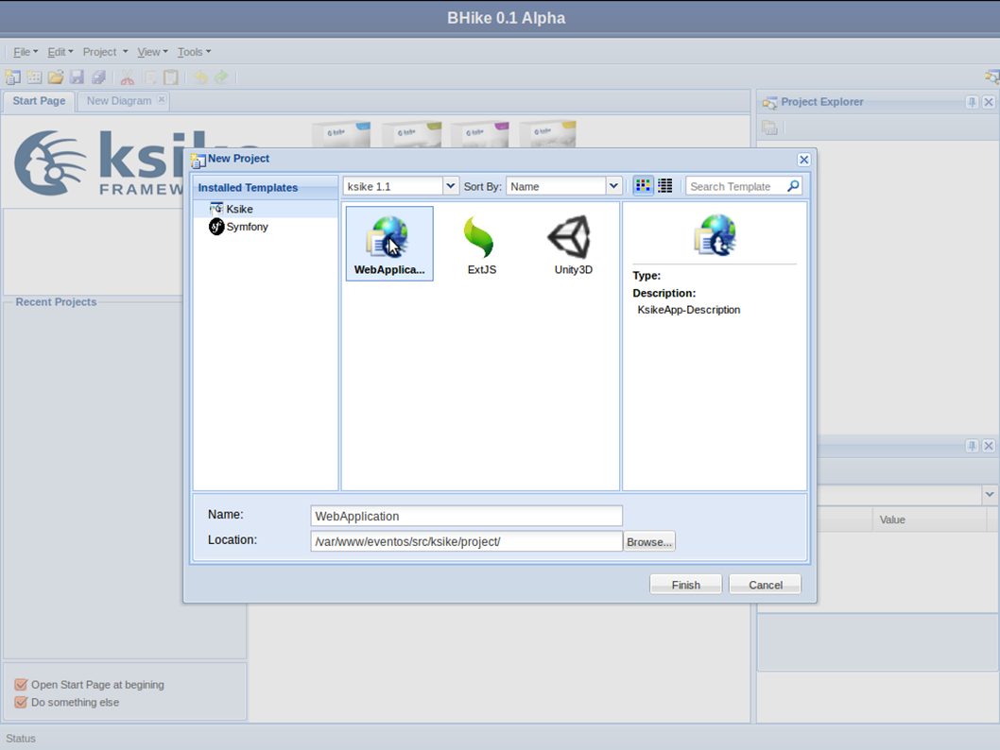
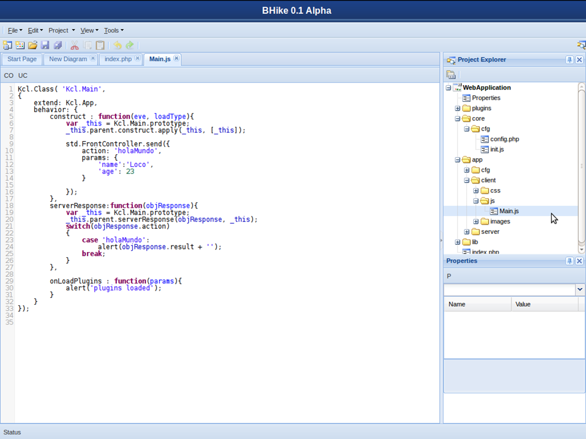
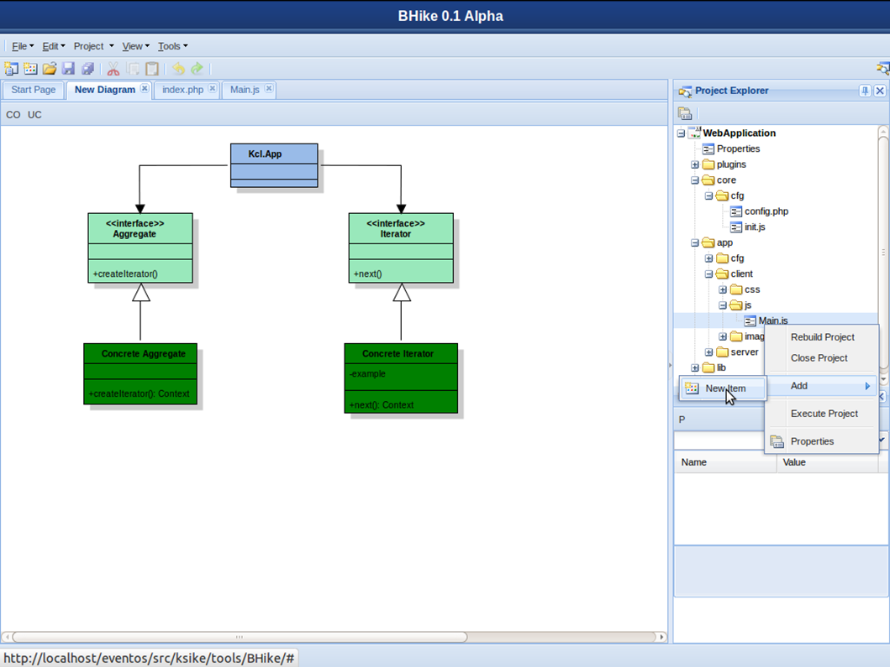
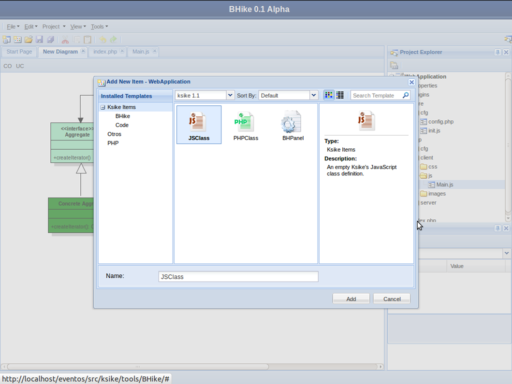

# Bhike IDE 
Bhike is defined as an Integrated Development Environment (IDE), in phonetics Taina is also known as the witcher or healer who solves everything. It is written on the Ksike Larva series framework, aimed primarily at streamlining development on frameworks such as Ksike, Symfony, etc.

Ksike framework shows up as an ideal variant for developing applications directed to any kind of environments and platforms thanks to the concept abstractions that it present, it features solutions to the most common problems in software developing. It makes possible to break the existing line between the way of building Web and desktop software. Although Ksike has great advantages, it does not count with an easy way to be learned and used, and among all other things, Ksike does not count with a tool that simplifies the use of its capabilities. That is why it becomes necessary the creation of a tool that solves the deficiencies previously mentioned.

At this point Bhike is conceived as an informatics solution that pretends to solve the deficiencies of Ksike platform, and it presents itself as an IDE containing a set of functionalities that allows the developers to achieve, in a more intuitive way, the materialization of a project. By using the mentioned framework integrated to Bhike application, the software developer should have in his hands a powerful tool. 

[For more information read here](docs/Bhike-herramienta.para.el.desarrollo.de.software.sobre.el.Framework.Ksike.pdf)

+ [Ksike Framework: Larva - focus on rich internet application development also known as RIA](https://github.com/ameksike/ksike.larva)
+ [Ksike Framework: Elephant - focus on PHP](https://github.com/ameksike/ksike.elephant)
+ [Ksike Framework: Rhino - focus on JavaScript and Node.js](https://github.com/ameksike/ksike.rhino.framework) 
+ [Ksike Framework: Coffee Cup - focus on Java](https://github.com/ameksike/ksike.java.core.plugin)

# 

Bhike se define como un Entorno Integrado de Desarrollo (IDE), escrito sobre el framework Ksike serie Larva, orientado principalmente a agilizar el desarrollo sobre marcos de trabajo como Ksike, Symfony, etc. La palabra Bhike proviene de la fonética Taina, en la que el termino es conocido como el bujo o curandero que lo resuelve todo, resultando un complemento esencial para la tecnología propuesta por Ksike.  

